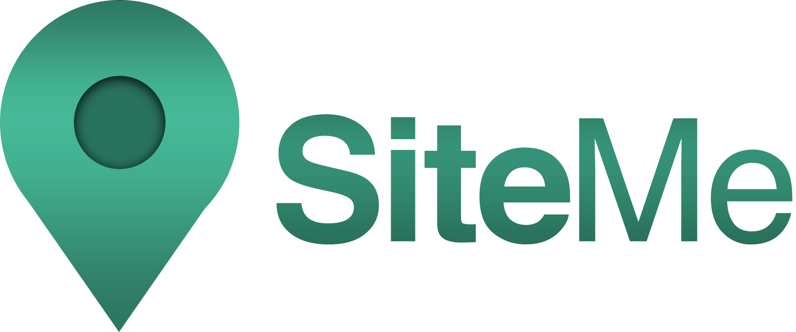

# SiteMe
Proyecto final para el ciclo formativo de Desarrollo de Aplicaciones Web (DAW). 

SiteMe es una aplicación web que permite al usuario descubrir establecimientos y lugares cercanos según un criterio de búsqueda, y almacenarlos en su cuenta para consultarlos siempre que quiera.

## 🔧  Tecnologías utilizadas
SiteMe funciona haciendo uso de los siguientes frameworks o librerías:
- Framework de PHP Symfony 5
- API de Google Maps Sites
- API de mapas de OpenStreetMaps
- Framework Bootstrap 4 para el diseño responsive
- Librería Leaflet para mostrar mapas
- Librería Micromodal.js para usar ventanas modales
- Iconos de FontAwesome

## 🚀 Despliegue
Para acceder al despliegue de la aplicación, puedes utilizar el **siguiente código QR desde tu smartphone:**

*Puede ser instalada en dispositivos con el navegador Google Chrome versión 67 o posterior, o un dispositivo con iOS 11.3 en adelante a través de Safari.*

**O bien accediendo [desde aquí](https://siteme-app.herokuapp.com/)**

## ✨ Nuevos cambios desde el fin del proyecto
Desde que el proyecto fue expuesto se han añadido nuevos cambios a la app.
- Nuevo modo oscuro/claro automático, que cambia según el tema del dispositivo.
- Notificaciones web push disponibles. Canal de informe de nuevos cambios con los clientes de la app. Relacionado con mi proyecto de [servidor de notificaciones](https://github.com/mfortea/servidor-push)
- Cambios visuales menores.

## ⚠️ Aviso 
Este proyecto es educativo, por lo que se deben de tener en cuenta estos puntos:
- *Debido a la limitación de peticiones de la versión gratuita de la API de Google Maps, **es posible que sus búsqueda obtengan el mismo resultado** almacenado de forma continua hasta que el Administrador las habilite* 
- *Se recomienda no utilizar la aplicación como una "aplicación comercial completa", ya que pueden producirse cambios en el contenido, las cuentas de usuario ...*
- *No se permite la creación "masiva" de cuentas desde una misma dirección IP, quedarán bloqueadas*
